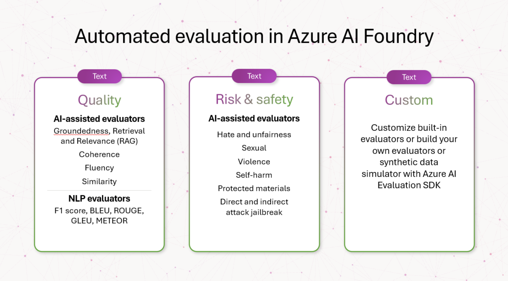
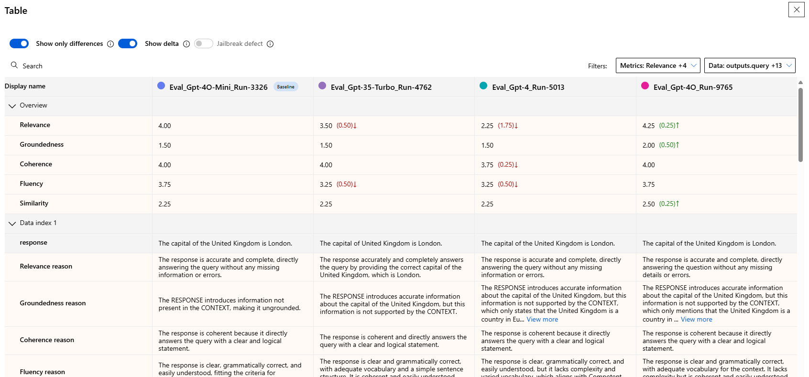
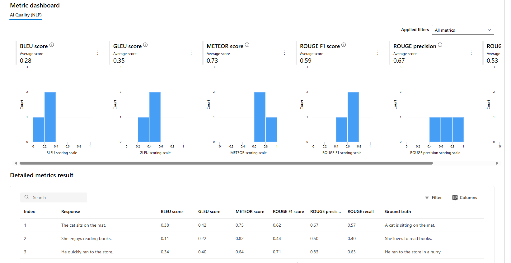

# Azure OpenAI Model Evaluation

In the dynamic field of AI, integrating Generative AI Operations (GenAIOps) is revolutionizing AI application development. Establishing a robust evaluation framework is essential to ensure AI outputs are reliable and relevant. Evaluators play a crucial role in assessing content risks and undesirable behaviors, helping teams address quality, safety, and security concerns throughout the AI lifecycle.

Effective evaluation strategies ensure that AI solutions meet expectations and adapt to real-world environments. Let's examine how evaluation integrates into three critical stages of the AI lifecycle.

Base Model Selection

The initial stage in the AI lifecycle is selecting the appropriate base model. Generative AI models have varied capabilities, making it vital to choose one that aligns with the business use case. During evaluation, compare models by testing their outputs against your criteria.

Consider:

•Accuracy/Quality: Does the model generate relevant and coherent responses?

•Performance on Specific Tasks: Can it handle your prompts and content? What about latency and cost?

•Bias and Ethical Considerations: Does it avoid harmful stereotypes?

•Risk and Safety: Are there risks of unsafe content?

Explore Azure AI Evaluation SDK as demonstrated in the Evaluate Model Endpoints sample and Azure AI Foundry benchmarks and visualise compare models




## Setup

### Pre-requisites
1. An Azure OpenAI Service resource with a model deployed with a provisioned deployment (either ```Provisioned``` or ```Provisioned-Managed```) deplyment type. For more information, see the [resource deployment guide](https://learn.microsoft.com/azure/ai-services/openai/how-to/create-resource?pivots=web-portal).
2. Your resource endpoint and access key. The script assumes the key is stored in the following environment variable: ```OPENAI_API_KEY```. For more information on finding your endpoint and key, see the [Azure OpenAI Quickstart](https://learn.microsoft.com/azure/ai-services/openai/quickstart?tabs=command-line&pivots=programming-language-python#retrieve-key-and-endpoint).
3. Azure AI project in the same regions as risk and safety evaluators. If you don't have an existing project, follow the guide How to create Azure AI project to create one.
4. Azure OpenAI Deployment with GPT model supporting chat completion, for example gpt-4.
5. Make sure you're first logged into your Azure subscription by running az login.

### Installation Instructions

Create a virtual Python environment of you choice. To create one using conda, run the following command
```
conda create -n cloud-evaluation
conda activate cloud-evaluation
```

### Building and running

Install the required packages by running the following command:
```
$ pip install -r requirements.txt
```

Set up environmentals variables for Azure OpenAI models deployments associated keys in the credentials.env
```
AZURE_OPENAI_ENDPOINT=""
AZURE_OPENAI_API_KEY=""
AZURE_OPENAI_DEPLOYMENT=""
AZURE_OPENAI_API_VERSION=""

# Model1
AZURE_OPENAI_GPT35_ENDPOINT=""
AZURE_OPENAI_GPT35_API_KEY=""

# Model2
AZURE_OPENAI_GPT4_ENDPOINT=""
AZURE_OPENAI_GPT4_API_KEY=""

# Model3
AZURE_OPENAI_GPT4o_ENDPOINT="
AZURE_OPENAI_GPT4o_API_KEY=""

# Model4
AZURE_OPENAI_GPT4o-mini_ENDPOINT=""
AZURE_OPENAI_GPT4o-mini_API_KEY=""
```

## AI-assisted: Groundedness
For groundedness we use Prompt-based groundedness using your own model deployment to output a score and an explanation for the score is currently supported in all regions.

For more information see the [Monitor metrics for generative AI] https://learn.microsoft.com/en-us/azure/ai-studio/concepts/evaluation-metrics-built-in?tabs=warning


## Base models performance and quality eveluation 
This involves assessing the different AOAI base model using same prompt for accuracy, groundedness, and relevance of generated content using robust AI-assisted metrics.


## NLP based mdoel eveluation 
Uisng traditional machine learning approaches to score and measures the similarity by shared tokens between the generated text and the ground truth, focusing on both precision and recall.



## Contributing

This project welcomes contributions and suggestions.  Most contributions require you to agree to a
Contributor License Agreement (CLA) declaring that you have the right to, and actually do, grant us
the rights to use your contribution. For details, visit https://cla.opensource.microsoft.com.

When you submit a pull request, a CLA bot will automatically determine whether you need to provide
a CLA and decorate the PR appropriately (e.g., status check, comment). Simply follow the instructions
provided by the bot. You will only need to do this once across all repos using our CLA.

This project has adopted the [Microsoft Open Source Code of Conduct](https://opensource.microsoft.com/codeofconduct/).
For more information see the [Code of Conduct FAQ](https://opensource.microsoft.com/codeofconduct/faq/) or
contact [opencode@microsoft.com](mailto:opencode@microsoft.com) with any additional questions or comments.

## Trademarks

This project may contain trademarks or logos for projects, products, or services. Authorized use of Microsoft 
trademarks or logos is subject to and must follow 
[Microsoft's Trademark & Brand Guidelines](https://www.microsoft.com/legal/intellectualproperty/trademarks/usage/general).
Use of Microsoft trademarks or logos in modified versions of this project must not cause confusion or imply Microsoft sponsorship.
Any use of third-party trademarks or logos are subject to those third-party's policies.
